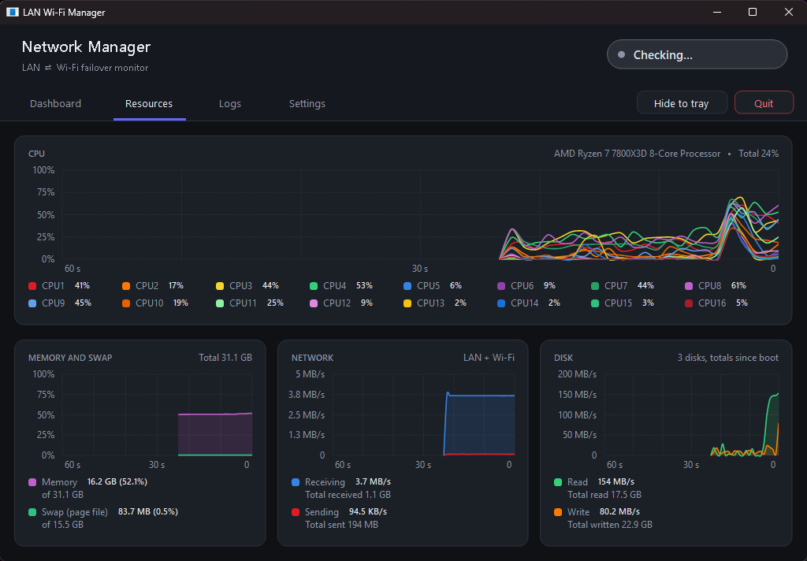
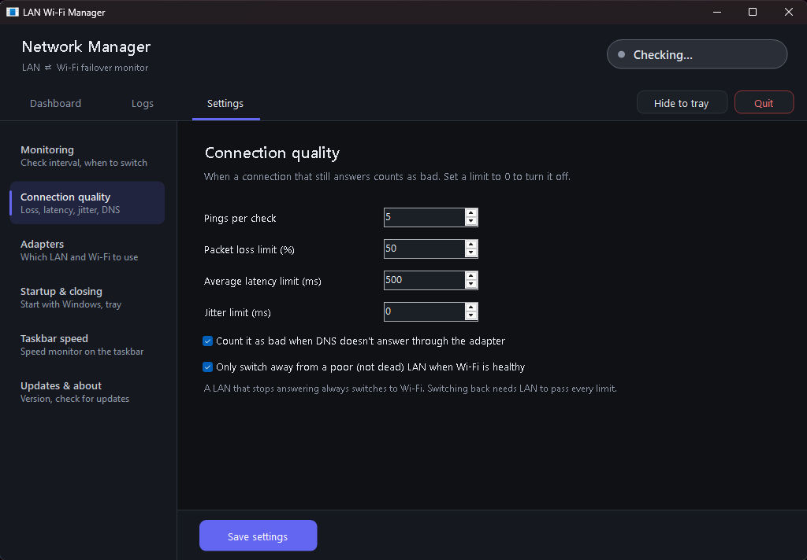

# LAN Wi-Fi Manager

A free Windows app that keeps you online when your PC is connected by **both LAN and Wi-Fi**. If the LAN stops working, or just gets bad, it moves your traffic to Wi-Fi. When the LAN is healthy again, it switches back.

## Download

1. Download **`LanWifiManager.exe`** from the [latest release](../../releases/latest).
2. Run it. It's a single portable file, so there is nothing to install. It needs Windows 10 or 11, which already include the .NET Framework 4.8 it uses.
3. It asks for administrator rights, because changing which connection Windows prefers needs them.
4. Windows SmartScreen may warn you because the app isn't code-signed. Click **More info → Run anyway**.

Once it's installed, the app updates itself: **Settings → Updates & about → Check for updates**.

> **Note:** GitHub adds **Source code (zip / tar.gz)** links to every release automatically. Here they only contain this README and the screenshots. The app's source code isn't published, so download **`LanWifiManager.exe`** instead.

## Features

- **Automatic failover.** It checks the internet through the LAN and through the Wi-Fi every 30 seconds by default, using several pings per check and a DNS test. It rates each connection *Good*, *Degraded* (packet loss, high latency, jitter, or DNS not answering) or *Down*.
  - A dead LAN switches to Wi-Fi.
  - A poor LAN switches only if the Wi-Fi is actually better.
  - It switches back once the LAN is healthy again.
- **Manual modes:** Use LAN, Use Wi-Fi, and Toggle, from the window or the tray icon.
- **Dashboard:** live latency chart for both connections, packet loss, jitter, DNS status, and which adapter carries your traffic.
- **Resources tab:** Ubuntu System Monitor style graphs for CPU (one line per core), memory and swap, network, and disk read/write, with totals.
- **Taskbar speed monitor:** live download/upload speed next to the tray icons. You can change its font, colors, background and position.
- **Runs in the background:** close to the tray, start with Windows, notifications, and a daily log file.

Both adapters stay connected the whole time. The app only changes which one Windows prefers (the interface metric), so switching is instant.

## Privacy

The app has no telemetry, no accounts and no data collection. It only connects to:

- **Your ping targets** (8.8.8.8 and 1.1.1.1 by default, and you can change them), to test each connection.
- **Your adapters' own DNS servers**, for the DNS check.
- **The GitHub API**, to check for updates. You can turn this off in Settings.

Settings and logs stay on your PC in `%AppData%\LanWifiManager`.

**Location:** to show your Wi-Fi network's name and signal, the app asks Windows for Wi-Fi details. Since Windows 11 24H2, Windows counts this as location access, because network names can reveal where you are, so it appears as "Network Command Shell" under Privacy & security → Location.

- The app asks for your consent first, and you can change it in Settings → Adapters.
- Even when allowed, it only reads Wi-Fi details while its window is open, once at startup, and when reconnecting Wi-Fi.
- It never reads GPS or coordinates, and sends nothing anywhere.

## Problems or ideas?

Open an [issue](../../issues).

## License

Freeware. You may use it for free, personally or at work. The source code isn't public. Please don't redistribute modified copies.
© 2026 bilal-nasr
