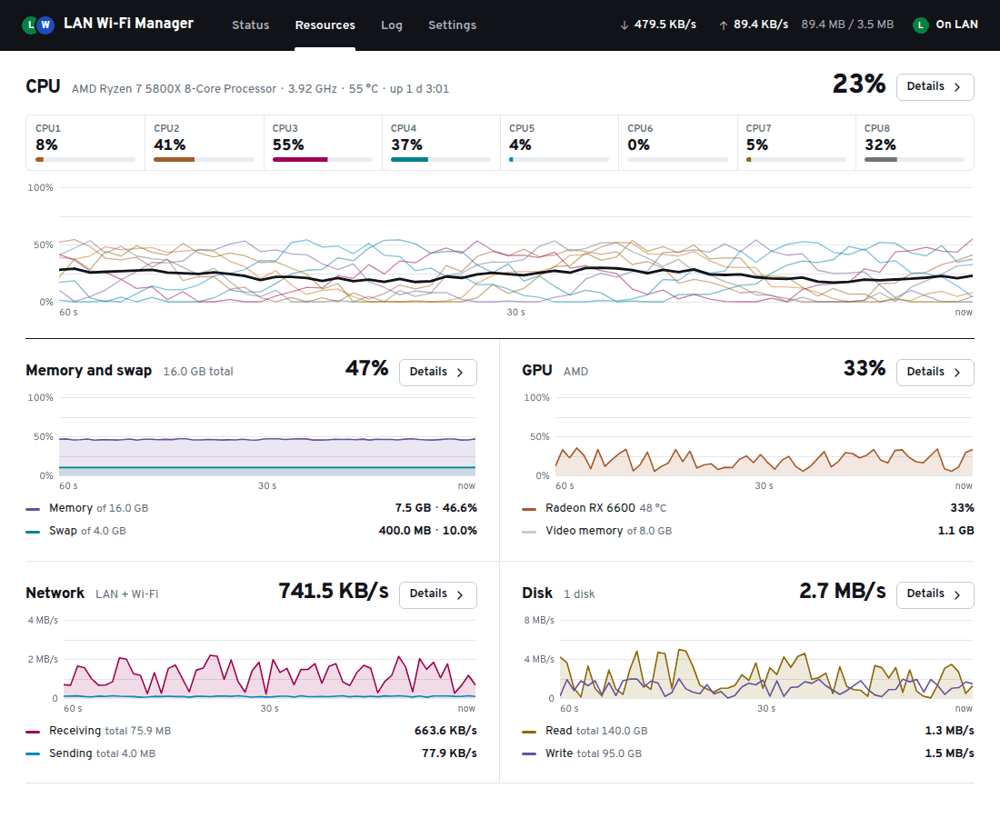
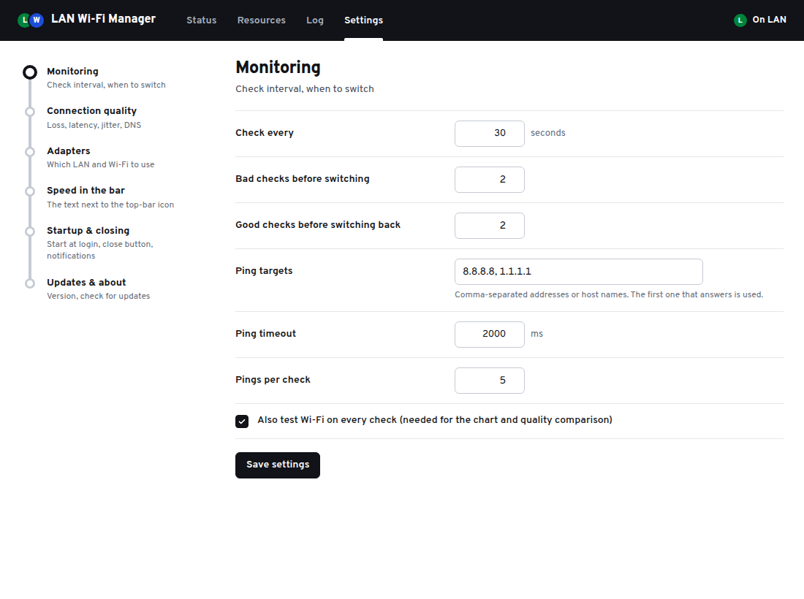

# LAN Wi-Fi Manager

A free app for **Windows, Ubuntu and macOS** that keeps you online when your computer is connected by **both LAN and Wi-Fi**. If the LAN stops working, or just gets bad, it moves your traffic to Wi-Fi. When the LAN is healthy again, it switches back.

## Download

Get the file for your system from the [latest release](../../releases/latest):

| System | File | Install |
| --- | --- | --- |
| **Windows 10 / 11** | `LanWifiManager.exe` | Run it — a single portable file, nothing to install. It asks for administrator rights, because changing which connection Windows prefers needs them. SmartScreen may warn you because the app isn't code-signed: **More info → Run anyway**. |
| **Ubuntu 24.04** | `LanWifiManager_<version>_amd64.deb` | In the download folder: `sudo apt install ./LanWifiManager_<version>_amd64.deb`, then open **LAN Wi-Fi Manager** from the app list. No password is needed to switch: NetworkManager allows it for the signed-in user. |
| **macOS 13.6 or later** *(preview)* | `LanWifiManager_<version>_universal.dmg` | Drag the app to **Applications** and open it. When macOS says it "could not verify" the app: **Done**, then **System Settings → Privacy & Security → Open Anyway** (needed again after every update). Allow the one-time switching helper when the app asks; this needs an administrator account. |

**The macOS build is a preview: it has not yet been tested on a real Mac.** Monitoring and the speed display work without the helper; only switching needs it.

The Windows app updates itself (**Settings → Updates & about → Check for updates**). On Ubuntu and macOS the app tells you when a new version is out and opens the download.

> **Note:** GitHub adds **Source code (zip / tar.gz)** links to every release automatically. Here they only contain this README and the screenshots. The app's source code isn't published, so download the file for your system instead.

## Features

- **Automatic failover.** It checks the internet through the LAN and through the Wi-Fi every 30 seconds by default, using several pings per check and a DNS test. It rates each connection *Good*, *Degraded* (packet loss, high latency, jitter, or DNS not answering) or *Down*.
  - A dead LAN switches to Wi-Fi.
  - A poor LAN switches only if the Wi-Fi is actually better.
  - It switches back once the LAN is healthy again.
- **Manual modes:** Use LAN, Use Wi-Fi, and Toggle, from the window or the tray / top-bar icon.
- **Dashboard:** live latency chart for both connections, packet loss, jitter, DNS status, and which adapter carries your traffic.
- **Resources tab:** graphs for CPU (one line per core), memory and swap, network and disk (and the GPU on Windows and Ubuntu), with a process list per resource and **End task**.
- **Live speed:** download/upload speed next to the tray icons on Windows, and in the top bar (top right) on Ubuntu and macOS.
- **Runs in the background:** close to the tray / top bar, start at login, notifications, and a daily log file.

Both adapters stay connected the whole time. The app only changes which one the system prefers, so switching is instant: the interface metric on Windows, the Wi-Fi route priority through NetworkManager on Ubuntu, and the network service order on macOS. When you quit, it puts the original preference back.

## Privacy

The app has no telemetry, no accounts and no data collection. It only connects to:

- **Your ping targets** (8.8.8.8 and 1.1.1.1 by default, and you can change them), to test each connection.
- **Your adapters' own DNS servers**, for the DNS check.
- **The GitHub API**, to check for updates. You can turn this off in Settings.

Settings and logs stay on your computer: `%AppData%\LanWifiManager` on Windows, `~/.config/LanWifiManager` on Ubuntu, `~/Library/Application Support/LanWifiManager` on macOS.

**Location (Windows):** to show your Wi-Fi network's name and signal, the app asks Windows for Wi-Fi details. Since Windows 11 24H2, Windows counts this as location access, because network names can reveal where you are, so it appears as "Network Command Shell" under Privacy & security → Location.

- The app asks for your consent first, and you can change it in Settings → Adapters.
- Even when allowed, it only reads Wi-Fi details while its window is open, once at startup, and when reconnecting Wi-Fi.
- It never reads GPS or coordinates, and sends nothing anywhere.

**macOS helper:** switching on macOS needs administrator rights, so the app installs a small helper once (with your password). It can only swap the order of two network services, nothing else. To remove it: **Settings → macOS → Remove…**, or run `sudo rm -f /private/etc/sudoers.d/lanwifimanager /Library/PrivilegedHelperTools/lanwifi-helper`.

## Problems or ideas?

Open an [issue](../../issues).

## License

Freeware. You may use it for free, personally or at work. The source code isn't public. Please don't redistribute modified copies.
© 2026 bilal-nasr
