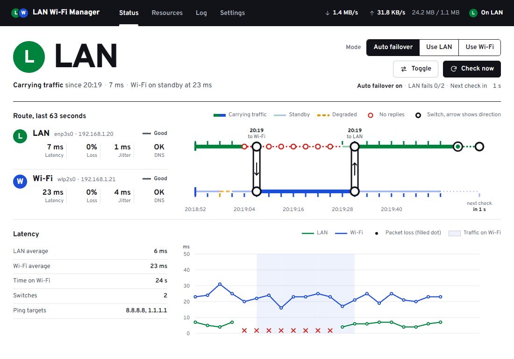

# LAN Wi-Fi Manager: automatic Ethernet to Wi-Fi failover

LAN Wi-Fi Manager is a free app for Windows and Ubuntu, with a macOS preview, that keeps you online when your computer is connected by both Ethernet (LAN) and Wi-Fi at the same time. It tests the internet through each adapter and, when the LAN fails or gets poor, makes Wi-Fi the preferred route, then switches back when the LAN recovers.

It helps when your Wi-Fi has its own route to the internet: a phone hotspot, a second provider or a separate router. If both come from the same router and that router or the provider is down, there is nothing better to switch to.

**[Website](https://bilal-nasr.github.io/lan-wifi-manager/)** · **[Download](https://github.com/bilal-nasr/lan-wifi-manager/releases/latest)** · **[FAQ](#faq)**

## At a glance

- **What it does:** tests the internet through the LAN and the Wi-Fi adapter separately (every 30 seconds by default) and changes which one the system prefers. Both stay connected, so the switch is instant.
- **Systems:** Windows 10 and 11 (portable exe), Ubuntu 24.04 (.deb), macOS 13.6 or later (preview, not yet tested on a real Mac).
- **Price and licence:** free for personal and work use. Closed source.
- **What it isn't:** not a VPN, proxy or bonding tool. One connection at a time, so it doesn't add speed.
- **Privacy:** no telemetry, no account.
- **Before you run it:** the Windows exe isn't code-signed, so SmartScreen warns, and it needs administrator rights.
- **Made by:** [bilal-nasr](https://github.com/bilal-nasr).

## Download

Get the file for your system from the [latest release](https://github.com/bilal-nasr/lan-wifi-manager/releases/latest):

| System | File | Install |
| --- | --- | --- |
| **Windows 10 / 11** | [`LanWifiManager.exe`](https://github.com/bilal-nasr/lan-wifi-manager/releases/latest/download/LanWifiManager.exe) | Run it — a single portable file, nothing to install. It asks for administrator rights, because changing which connection Windows prefers needs them. SmartScreen may warn you because the app isn't code-signed: **More info → Run anyway**. |
| **Ubuntu 24.04** | `LanWifiManager_<version>_amd64.deb` | In the download folder: `sudo apt install ./LanWifiManager_<version>_amd64.deb`, then open **LAN Wi-Fi Manager** from the app list. No password is needed to switch: NetworkManager allows it for the signed-in user. |
| **macOS 13.6 or later** *(preview)* | `LanWifiManager_<version>_universal.dmg` | Drag the app to **Applications** and open it. When macOS says it "could not verify" the app: **Done**, then **System Settings → Privacy & Security → Open Anyway** (needed again after every update). Allow the one-time switching helper when the app asks; this needs an administrator account. |

**The macOS build is a preview: it has not yet been tested on a real Mac.** Monitoring and the speed display work without the helper; only switching needs it.

The Windows app updates itself (**Settings → Updates & about → Check for updates**). On Ubuntu and macOS the app tells you when a new version is out and opens the download.

> **Note:** GitHub adds **Source code (zip / tar.gz)** links to every release automatically. Here they contain this README, the screenshots and the website, not the app's source code, which isn't published. Download the file for your system instead.

## Features

- **Automatic failover.** It checks the internet through the LAN and through the Wi-Fi every 30 seconds by default, using several pings per check and a DNS test. It rates each connection *Good*, *Degraded* (packet loss, high latency, jitter, or DNS not answering) or *Down*.
  - A dead LAN switches to Wi-Fi.
  - A poor LAN switches only if the Wi-Fi is actually better.
  - It switches back once the LAN is healthy again.
- **Manual modes:** Use LAN, Use Wi-Fi, and Toggle, from the window or the tray / top-bar icon.
- **Status tab:** a two-line route map showing which connection carries your traffic, with latency, packet loss, jitter and DNS status for both links.
- **Resources tab:** a CPU core strip and history plot, plus panels for memory and swap, GPU, network and disk, with a process list per resource and **End task**.
- **Live speed:** download/upload speed next to the tray icons on Windows, and in the top bar (top right) on Ubuntu and macOS.
- **Runs in the background:** close to the tray / top bar, start at login, notifications, and a daily log file.

Both adapters stay connected the whole time. The app only changes which one the system prefers, so switching is instant: the interface metric on Windows, the Wi-Fi route priority through NetworkManager on Ubuntu, and the network service order on macOS. When you quit, it hands the priority back to the system: on Windows it turns automatic metrics back on, and on Ubuntu and macOS it restores the original order. You can turn this off in Settings.

## FAQ

**Can I use Ethernet and Wi-Fi at the same time?**
Yes. Windows, Ubuntu and macOS all let both stay connected, but they send your traffic through one of them, usually Ethernet. LAN Wi-Fi Manager keeps both connected and decides which one carries the traffic, based on how well each one actually reaches the internet.

**Doesn't Windows already switch to Wi-Fi when Ethernet fails?**
Only reliably when the Ethernet link itself goes down, for example when the cable is unplugged. If the cable stays connected but the router, the modem or the network behind the cable stops working, Windows may keep sending traffic over Ethernet. This app pings the internet through each adapter, so it notices that case, and a poor connection too. Switching only helps if your Wi-Fi reaches the internet a different way (a phone hotspot, a second provider or a separate router); if both come from the same router and that router or the provider is down, there is nothing better to switch to.

**How is this different from setting the interface metric by hand?**
A manual metric never changes; the app changes the metric only when the checks call for it. A metric you set by hand (`Set-NetIPInterface`, or unticking "Automatic metric") doesn't react when the LAN fails and doesn't switch back when it recovers. The app also turns automatic metrics back on when you quit (a setting that is on by default), so a metric you set by hand is not kept. On Ubuntu it does the same with the NetworkManager route metric, so you don't need `nmcli` or scripts.

**Does it combine both connections or send my traffic through a server, like Speedify?**
No. It uses one connection at a time, chosen by the system's own routing, and your traffic goes out directly. It doesn't add speed, and there is no VPN or proxy. Speedify is a bonding VPN service that routes traffic through its own servers; LAN Wi-Fi Manager only changes which local connection your computer prefers.

**Is it free and open source?**
It's free, but not open source. You can use it at no cost, at home or at work, with no ads or paid tier. The source code isn't published; this repository holds the README, screenshots, website and releases.

**Why does Windows warn me, and why does it need administrator rights?**
The app isn't code-signed, so SmartScreen shows a warning the first time (**More info → Run anyway**). Administrator rights are needed because Windows only lets administrators change which connection it prefers.

## Privacy

The app has no telemetry, no accounts and no data collection. It only connects to:

- **Your ping targets** (8.8.8.8 and 1.1.1.1 by default, and you can change them), to test each connection.
- **Your adapters' own DNS servers**, for the DNS check.
- **The GitHub API**, to check for updates. You can turn this off in Settings.

Settings and logs stay on your computer: `%AppData%\LanWifiManager` on Windows, `~/.config/LanWifiManager` on Ubuntu, `~/Library/Application Support/LanWifiManager` on macOS.

**Location (Windows):** to show your Wi-Fi network's name and signal, the app asks Windows for Wi-Fi details. Since Windows 11 24H2, Windows counts this as location access, because network names can reveal where you are, so it appears as "Network Command Shell" under Privacy & security → Location.

- The app asks for your consent first, and you can change it in Settings → Adapters.
- Even when allowed, it only reads Wi-Fi details while its window is open, once at startup, and when reconnecting Wi-Fi.
- It never reads GPS or coordinates, and sends nothing anywhere.

**macOS helper:** switching on macOS needs administrator rights, so the app installs a small helper once (with your password). It can only swap the order of two network services, nothing else. To remove it: **Settings → macOS → Remove…**, or run `sudo rm -f /private/etc/sudoers.d/lanwifimanager /Library/PrivilegedHelperTools/lanwifi-helper`.

## Problems or ideas?

Open an [issue](https://github.com/bilal-nasr/lan-wifi-manager/issues).

## License

Freeware. You may use it for free, personally or at work. The source code isn't public. Please don't redistribute modified copies.
© 2026 bilal-nasr

The bundled Overpass font is © 2021 The Overpass Project Authors and is licensed under the [SIL Open Font License 1.1](https://openfontlicense.org), which applies to the font independently of the app licence. The full font licence is available in Settings → Updates & about.
